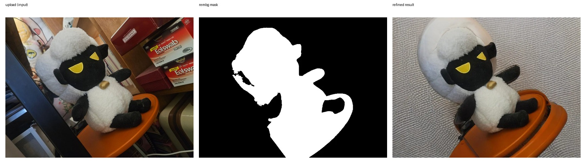
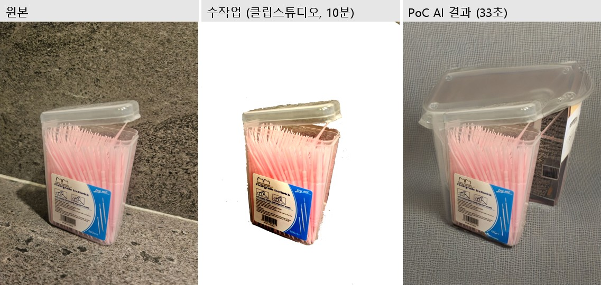

# 자가 촬영 상품 사진 배경/조명 정제 PoC

집에서 직접 촬영한 상품 사진의 배경/조명 문제를 rembg + Diffusion inpainting으로 자동 정제한다.

## 문서 구성
- **문제 정의서**: [`docs/PROBLEM_DEFINITION.md`](docs/PROBLEM_DEFINITION.md) (도메인, 현재의 문제, 개선 가설, 대상 사용자, 성공 기준)
- **PoC 코드**: [`src/mask.py`](src/mask.py), [`src/segment.py`](src/segment.py), [`src/inpaint.py`](src/inpaint.py), [`app.py`](app.py) — 모델 선정 근거는 [`docs/MODEL_SELECTION.md`](docs/MODEL_SELECTION.md) 참고
- **개선 효과 검증 결과**: [`docs/RESULTS.md`](docs/RESULTS.md) (기존 수작업과의 비교, 실패 사례 포함)
- **회고**: [`docs/RETROSPECTIVE.md`](docs/RETROSPECTIVE.md) (모델 선정 과정, 성공 기준 설정, 라이선스 이슈에 대한 회고)
- **README**(이 문서): 실행 방법 + 아래 [실행 결과](#실행-결과)의 시연 자료

## 문제
스튜디오 장비 없이 촬영한 상품 사진은 배경이 지저분하거나 조명이 고르지 않아 상세페이지에 그대로 쓰기 어렵다. 자세한 배경은 [`docs/PROBLEM_DEFINITION.md`](docs/PROBLEM_DEFINITION.md) 참고.

## 파이프라인
```
촬영 이미지 → rembg(상품 영역 분할) → Diffusion inpainting(배경 재생성) → 합성 → 정제된 상세페이지용 이미지
```

모델 선정 근거(상품 영역 분할, 배경 재생성 각 단계의 대안 비교)는 [`docs/MODEL_SELECTION.md`](docs/MODEL_SELECTION.md)에 정리했다.

## 환경 준비
```bash
# Python 3.12, uv 사용
uv venv
.venv\Scripts\activate        # Windows
# source .venv/bin/activate   # macOS/Linux

# torch/torchvision이 CUDA 12.4 빌드(+cu124)로 고정돼 있어 PyPI 기본 인덱스엔 없음 —
# PyTorch 인덱스를 추가로 지정해야 설치된다.
uv pip install -r requirements.txt --extra-index-url https://download.pytorch.org/whl/cu124
```
- CUDA 12.4가 아니거나 GPU가 없다면, `requirements.txt`의 `torch==2.6.0+cu124` /
  `torchvision==0.21.0+cu124` 두 줄을 본인 환경에 맞는 버전(예: CPU 전용이면 `+cu124` 접미사를 뗀
  버전)으로 바꾼 뒤 설치해야 합니다.
- rembg(U2-Net) 모델은 최초 실행 시 자동 다운로드됩니다(약 176MB, `~/.rembg/models/`에 캐시).
- `runwayml/stable-diffusion-inpainting` 모델은 최초 실행 시 Hugging Face 캐시에 자동 다운로드됩니다(fp16, 약 4GB).
- GPU(CUDA) 권장 — 이 프로젝트는 RTX 3060(12GB)에서 검증했습니다. GPU가 없으면 CPU로도 동작하지만 매우 느립니다.

## 사용법
```bash
# 0) data/raw/에 본인이 촬영한 상품 사진을 넣는다.
#    저장소에는 예시 이미지가 포함돼 있지 않으므로(용량 문제로 .gitignore 처리) 직접 채워야 한다.

# 1) 분할: 마스크 오버레이 확인용 (data/output/masks/에 저장)
python -m src.segment

# 2) 배경 정제: data/raw/의 전체 이미지를 배경만 diffusion inpainting (data/output/refined/에 저장)
python -m src.inpaint

# 3) Gradio 데모: 사진 한 장을 업로드해 바로 결과 확인
python app.py
```
`data/raw/`가 비어있으면 1), 2)단계는 에러 없이 "0장 대상"으로 조용히 끝나니, 사진이 실제로 들어있는지
먼저 확인하세요. `app.py` 실행 후 터미널에 뜨는 로컬 주소(기본 http://127.0.0.1:7860) 로 접속하면 됩니다.

## 실행 결과

`python app.py` 실행 후 실제로 사진을 업로드해 나온 결과 (Gradio 데모):



수작업(클립스튜디오) vs AI 결과 비교 등 더 많은 사례는 [`docs/RESULTS.md`](docs/RESULTS.md)에서 볼 수 있다:



- `data/output/masks/` — rembg 분할 결과 오버레이 (20장 전체)
- `data/output/refined/` — 배경 정제 최종 결과 (20장 전체)

## 개선 효과 검증 결과
20장 전체에 대한 성공/실패 분류, 원인 분석, 수작업 대비 처리 시간 비교는
[`docs/RESULTS.md`](docs/RESULTS.md)에 정리했다.
