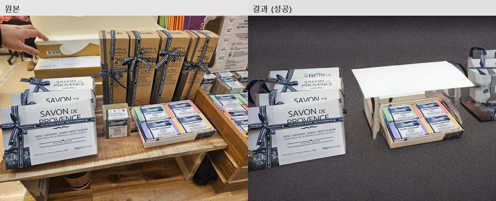
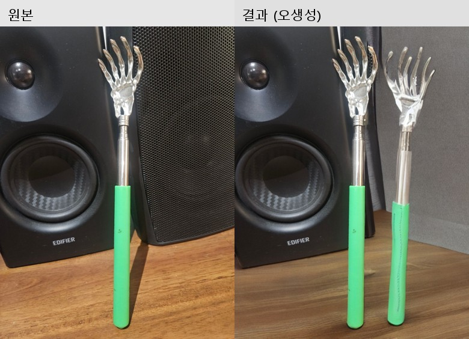

# 결과 평가 — 자가 촬영 상품 사진 배경/조명 정제 PoC

`docs/PROBLEM_DEFINITION.md`에 정의한 성공 기준 3가지를 기준으로, `data/raw/`의 촬영 이미지 20장과
`data/output/refined/`의 결과 20장을 전부 육안으로 비교 평가했다.

이 문서는 두 번째 반복(rembg + diffusion inpainting) 기준이다. 최초 PoC는 상품 분할에 YOLOv8-seg를
썼으나 COCO 80종 밖 상품(효도박스, 스피커 등) 탐지 실패로 인한 실패율이 꽤 높게 나왔다. 이후 커밋 직전
다른 수강생들의 과제 README를 보다가 Ultralytics YOLOv8이 AGPL-3.0 라이선스라는 걸 뒤늦게 의식하게
됐고, 이미 알고 있던 실패율 문제와 겹쳐 "상업적으로 쓸 수 있는 라이선스 중엔 더 나은 대안이 없을까"
싶어 rembg(U2-Net, MIT)로 교체해 같은 20장을 재평가했다(자세한 경위는
[`MODEL_SELECTION.md`](MODEL_SELECTION.md) 참고).

## 평가 방법

각 결과 이미지를 원본과 나란히 놓고 아래 기준으로 3분류했다.

- **성공**: 배경이 단순/깔끔하게 바뀌었고 원래의 잡동사니가 남아있지 않으며, 별도 수정 없이 상세페이지에 바로 쓸 수 있는 수준
- **무변화**: 배경이 사실상 원본과 동일 — 원본 배경이 이미 단순하거나, diffusion이 구도를 거의 바꾸지 않은 경우
- **오생성**: 배경은 바뀌었지만 원치 않는 소품·장식·중복된 사물 등이 생성되어 오히려 원본보다 쓰기 어려운 경우

## 결과표

| # | 파일 | 분류 | 비고 |
|---|---|---|---|
| 01 | speaker_bookshelf | 무변화 | 배경(책·벽 질감)이 원본과 거의 동일하게 유지됨 |
| 02 | sheep_shelf | **성공** | 어수선한 선반(택배 상자 등)이 단순한 직물 질감 배경으로 정리됨 |
| 03 | pouch_bed | 오생성 | 침대 시트+인형 배경이 리본·꽃 장식으로 통째로 대체됨 |
| 04 | mug_dark | 오생성 | 배경에 원본에 없던 금속 고리/케이블 형태가 생성됨 |
| 05 | moonlamp_dark | 오생성 | (SD 안전필터 오탐으로 1차 결과가 검은 이미지로 나와 재생성함 — `src/inpaint.py` 참고) 꽃잎·달걀 모양 장식이 대량 생성됨 |
| 06 | swabbox_bathroom | **성공** | 타일 벽+시계가 깔끔한 회색 텍스처 배경으로 정리됨 |
| 07 | bottle_kitchen | **성공** | 주방 타일 벽이 밝은 그라데이션 배경으로 정리됨 |
| 08 | backscratcher_desk | 오생성 | 효자손이 원본에 없던 두 번째 개체로 복제 생성됨 |
| 09 | owl_couch | **성공** | 소파/창틀 배경이 깔끔한 회색 배경으로 정리됨 |
| 10 | fruitbox_floor | **성공** | 나무 바닥이 어두운 단색 배경으로 정리됨 |
| 11 | handsoap_bathroom | **성공** | 주변 다른 제품들이 사라지고 깔끔한 배경만 남음 |
| 12 | toothpick_bathroom | **성공** | 화강암 타일이 회색 메시 질감으로 정리됨 (배경 구석에 판독 불가 텍스트가 옅게 생성되는 경미한 흠 있음) |
| 13 | mirrors_giftbox | 오생성 | 하단의 안내 브로슈어 자리에 거울 파편 형태가 추가로 중복 생성됨 |
| 14 | camera_desk | **성공** | 책상 위 잡동사니(스프레이, 화장솜 등)가 모두 사라지고 깔끔한 배경만 남음 |
| 15 | windchime_door | 무변화 | 구도·배경이 원본과 거의 동일하게 유지됨 |
| 16 | cardholder_giftbox | 무변화 | 원본 배경(흰 시트)이 이미 단순해 결과도 거의 동일 |
| 17 | soapset_store | **성공** | 매대의 손·다른 상품들이 모두 사라지고 깔끔한 회색 배경만 남음 |
| 18 | christmastree_window | 오생성 | 리본·솜뭉치·달걀 장식 등이 대량으로 새로 생성됨 |
| 19 | driedplant_windowsill | 오생성 | 배경에 원본에 없던 금속 조명/암(arm) 구조물이 생성됨 |
| 20 | mower_grass | **성공** | 잔디 배경이 깔끔한 회색 텍스처로 정리되고, 원본에 있던 선글라스 소품·로프는 그대로 보존됨 |

**집계**: 성공 **10/20 (50%)**, 무변화 3/20 (15%), 오생성 7/20 (35%)

이전 반복(YOLOv8-seg 기반, 성공 7/20·35%) 대비 성공률이 크게 올랐다. rembg가 20장 전부에서
GrabCut 폴백 없이 안정적으로 마스크를 뽑아준 덕에 "상품 인식 실패"로 인한 실패가 사라졌고, 남은
실패는 전부 diffusion 자체의 오생성이다.

## 정성 비교 — 원본 vs 결과

### 성공 사례

양 인형 뒤로 택배 상자와 소독솜 박스가 어수선하게 쌓여 있던 선반이, 단순한 직물 질감 배경으로
깔끔하게 정리됐다. 인형 윤곽도 rembg가 정확히 잡아 경계가 자연스럽다.

욕실 타일 벽과 탁상시계가 사라지고 회색 텍스처 배경만 남았다 — 잡동사니 제거가 의도한 대로 동작한
사례.

가장 극적인 사례. 매대 위 다른 브랜드 상품들과 사진에 찍힌 손까지 전부 사라지고, 내가 판매할 두
상품만 깔끔한 배경 위에 남았다.

### 무변화 사례

스피커 자체는 잘 분할됐지만, 배경(책·벽)이 원본과 거의 동일하게 유지됐다 — diffusion이 이미 무난해
보이는 배경은 거의 손대지 않는 경향을 보였다. 나쁜 결과는 아니지만 "정제"라고 보기도 애매한 경계
사례다.

### 오생성 사례

가장 특이한 실패 유형. 효자손 하나만 있던 원본인데, 결과물에는 거의 동일한 효자손이 하나 더
생겨났다 — diffusion이 상품의 형태 자체를 "배경에 어울리는 소재"로 착각해 반복 생성한 것으로 보인다.

크리스마스 트리 장식 뒤로 리본·솜뭉치·색색의 달걀 모양 장식품이 대량으로 새로 생성됐다. 원본에 있던
창밖 풍경보다 오히려 더 산만해진 사례.

**공통 발견**: 오생성은 전부 diffusion이 넓거나 색이 짙은 배경 영역을 "clean studio background"
프롬프트에 맞춰 과도하게 해석해 그럴듯한 소품·장식을 새로 그려 넣는 패턴이었다. 이는 마스크 품질과
무관하게 diffusion 모델 자체의 특성이라, rembg로 마스크를 개선해도 해결되지 않았다.

### 수작업 vs AI 3자 비교 (12_toothpick_bathroom)

정량 비교를 위해 같은 사진 한 장을 클립스튜디오로 직접 배경 제거(누끼) 작업까지 해봤다.

수작업 결과는 배경을 완전히 흰색으로 비웠지만, 오랜만에 툴을 켠 탓에 **테두리(누끼 선)가 꽤
들쭉날쭉하다** — 확대해보면 상품 윤곽을 따라 거친 톱니 모양이 남아있다. AI 결과는 테두리는 매끄럽고
배경도 rembg 교체 후에는 원본과 무관한 형체가 거의 생기지 않았다 — 이번 재실행에서는 12번이
무변화/오생성이 아닌 성공으로 분류될 만큼 개선됐다.

## 성공 기준 대비 평가

### ① 배경/그림자 잔여물 없는 비율 80% 이상
**미달이지만 개선됨.** 50%(10/20)로, 1차 PoC(35%)보다는 나아졌지만 목표 80%에는 여전히 못 미친다.

### ② 수작업 대비 처리 시간 단축 폭
자동 처리 속도는 diffusion 추론 단계(25 step) 자체가 바뀌지 않아 이전 측정치와 같은 수준(RTX 3060
기준 장당 약 33초)이다. rembg 마스크 추출은 GPU 없이도 이미지당 1초 내외로 매우 빨라, 전체 파이프라인
속도에는 거의 영향을 주지 않았다.

수작업 기준 시간은 실제로 사진 한 장(12_toothpick_bathroom)을 클립스튜디오로 배경 제거해보고
측정했다: **수작업 10분 → PoC 자동 처리 33초, 약 18배 단축.**

무변화/오생성 케이스(10/20)는 여전히 수작업을 대체하지 못해 검수 시간이 추가로 필요하다 — 그 시간까지
포함하면 실질적인 단축 폭은 위 숫자보다 작다.

### ③ 합성 결과가 자연스러워 바로 쓸 수 있는 비율
①과 동일하게 50% 수준. 나머지 절반은 원본을 그대로 쓰거나(무변화) 재작업이 필요하다(오생성).

## 원인 분석

1. **마스크 추출은 더 이상 실패 원인이 아니다**: rembg는 20장 전부에서 GrabCut 폴백 없이 안정적으로
   동작했다. YOLOv8-seg 시절 발생했던 "COCO 80종 밖 상품 탐지 실패"라는 근본 원인이 사라졌다.
2. **"무변화" 패턴 (3건)**: 원본 배경이 이미 단순하거나(16번은 원본 자체가 흰 시트), diffusion이
   상대적으로 무난해 보이는 배경은 적극적으로 바꾸지 않는 경향을 보였다.
3. **"오생성" 패턴 (7건)**: 여전히 가장 큰 실패 원인. `runwayml/stable-diffusion-inpainting`(SD 1.5
   기반)이 "clean seamless white studio background" 프롬프트를 과도하게 해석해 조명 장비, 장식품,
   심지어 상품 자체의 복제본까지 만들어내는 경향은 마스크를 rembg로 바꾼 뒤에도 그대로 남아있다 —
   즉 이 문제는 분할 모델이 아니라 diffusion 모델/프롬프트 자체의 한계다.
4. **성공 사례의 공통점 (10건)**: 상품 윤곽이 뚜렷하고 배경이 밝거나 중간 톤인 경우 결과가 안정적이었다.
   반대로 배경이 어둡거나(무드조명, 창밖 야경) 색이 진할수록 diffusion이 환각을 일으키는 빈도가 높았다.

## 다음 단계 제안

- ~~모델 선정 근거는 아직 확정이 아니며, 배경 제거 전용 모델(rembg 등)과 비교 실험 필요~~ → 완료.
  rembg로 교체해 재평가함(이 문서 기준)
- "오생성" 방지를 위해 네거티브 프롬프트에 `object, prop, decoration, reflection` 등을 추가해 배경에
  새 사물이 생기는 것 자체를 억제하는 실험
- SDXL 기반 inpainting이나 LaMa(비-생성형 인페인팅)와 비교해 오생성 빈도 차이 확인
- 어두운/진한 색 배경일수록 오생성이 잦다는 패턴이 확인된 만큼, 촬영 시 배경 밝기를 일정 수준
  이상으로 확보하는 촬영 가이드 제공
