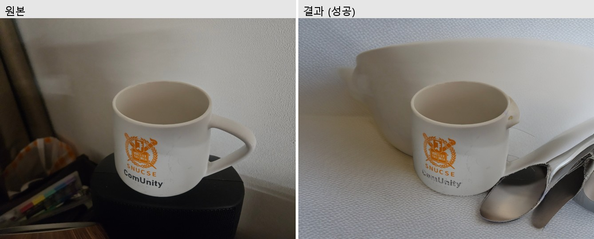
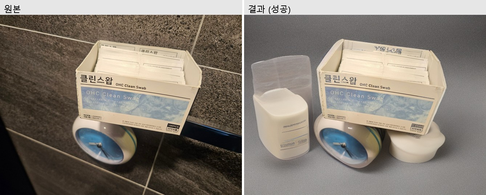
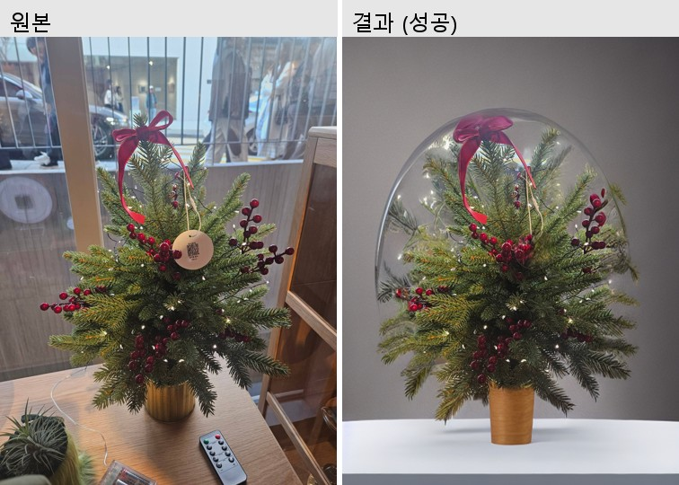
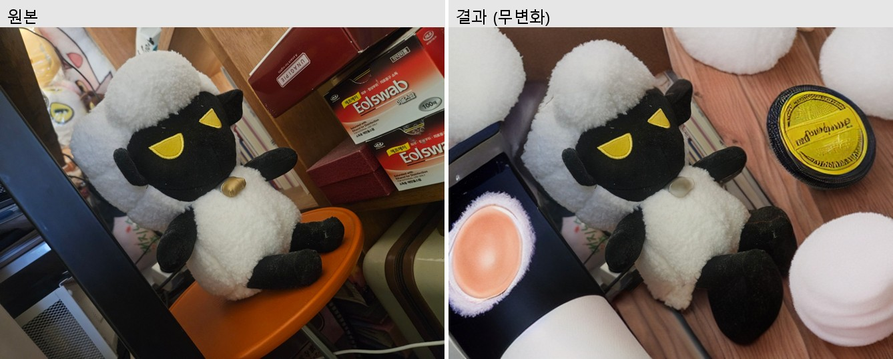
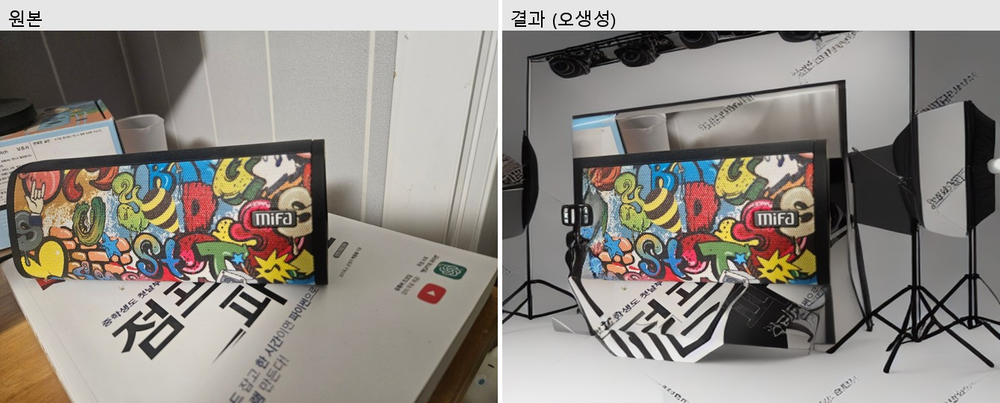
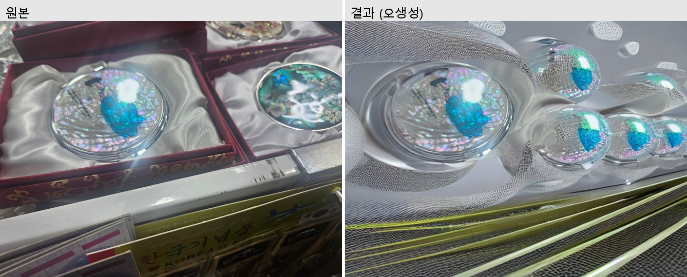

# 결과 평가 — 자가 촬영 상품 사진 배경/조명 정제 PoC

`docs/PROBLEM_DEFINITION.md`에 정의한 성공 기준 3가지를 기준으로, `data/raw/`의 촬영 이미지 20장과
`data/output/refined/`의 결과 20장을 전부 육안으로 비교 평가했다.

## 평가 방법

각 결과 이미지를 원본과 나란히 놓고 아래 기준으로 3분류했다.

- **성공**: 배경이 단순/깔끔하게 바뀌었고 원래의 잡동사니가 남아있지 않으며, 별도 수정 없이 상세페이지에 바로 쓸 수 있는 수준
- **무변화**: 배경이 사실상 원본과 동일 — 상품 마스크가 화면 대부분을 차지해 inpainting 대상 영역이 거의 남지 않은 경우
- **오생성**: 배경은 바뀌었지만 스튜디오 조명 장비, 추상적인 반사 구체, 중복된 사물 등 원치 않는 내용이 생성되어 오히려 원본보다 쓰기 어려운 경우

## 결과표

| # | 파일 | 분류 | 비고 |
|---|---|---|---|
| 01 | speaker_bookshelf | 오생성 | 배경이 실제 촬영 스튜디오 장비(조명, 스탠드) 통째로 생성됨 + 원본 책 문구 일부가 마스크 경계에 남음 |
| 02 | sheep_shelf | 무변화 | 마스크가 화면 대부분을 덮어 배경 영역 거의 없음 |
| 03 | pouch_bed | 무변화 | 위와 동일 패턴 |
| 04 | mug_dark | **성공** | 배경이 무난한 흰색 계열로 정리됨 (배경에 삼각형 형태의 경미한 아티팩트) |
| 05 | moonlamp_dark | 성공(경계) | 스튜디오풍 배경으로 바뀌었으나 기하학적 패턴이 다소 인위적 |
| 06 | swabbox_bathroom | **성공** | 깔끔한 회색 그라데이션 배경, 잡동사니 완전 제거 |
| 07 | bottle_kitchen | **성공** | 깔끔한 밝은 배경, 원본의 다른 주방 잡동사니 제거됨 |
| 08 | backscratcher_desk | 성공(경계) | 스튜디오 천 배경으로 자연스러운 편, 좌하단에 원본 텍스트 잔여 아주 조금 |
| 09 | owl_couch | 오생성 | 배경이 정체불명의 금속 구체 형태로 생성됨 |
| 10 | fruitbox_floor | 무변화 | 마스크가 상자 전체를 덮어 배경 거의 없음 |
| 11 | handsoap_bathroom | 무변화 | 욕실 타일 배경 그대로 |
| 12 | toothpick_bathroom | **성공** | 깔끔한 회색 배경 |
| 13 | mirrors_giftbox | 오생성 | 추상적인 반사 구체 다수 생성 — 상품 식별 불가 수준 |
| 14 | camera_desk | 오생성 | 알 수 없는 기하학적 구조물 생성 |
| 15 | windchime_door | 오생성 | 원본에 없던 사물이 여러 개 중복 생성됨 |
| 16 | cardholder_giftbox | 무변화 | 원본 구도 그대로 (다만 원본 자체가 비교적 깔끔했던 케이스) |
| 17 | soapset_store | 무변화 | 매대 배경 그대로 |
| 18 | christmastree_window | **성공** | 깔끔한 회색 그라데이션 배경 |
| 19 | driedplant_windowsill | 오생성 | 배경에 원본에 없던 형체가 여러 번 중복 생성됨 |
| 20 | mower_grass | 무변화 | 원단 질감 배경 그대로, 주변 잡동사니 그대로 남음 |

**집계**: 성공 5장 + 성공(경계) 2장 = 최대 7/20 (35%), 무변화 8/20 (40%), 오생성 5/20 (25%)

## 정성 비교 — 원본 vs 결과 (샘플 6건)

대표 사례를 원본과 나란히 놓고 비교했다. 성공 3건, 무변화 1건, 오생성 2건을 골랐다.

### 성공 사례

머그컵은 배경이 원래의 어수선한 벽/스피커에서 밝은 배경으로 바뀌었다. 다만 자세히 보면 원본에는
없던 **흰 그릇과 스푼 두 개가 새로 생성**되어 있다 — "빈 배경"이 아니라 그럴듯한 소품을 만들어 채운
것이다. 우연히 제품 사진 스타일링처럼 보여 그대로 써도 위화감이 적은 케이스다.

면봉통도 마찬가지로 배경의 욕실 타일은 사라졌지만, 원본에 없던 **투명 통과 흰색 용기가 새로 생성**됐다.
역시 우연히 자연스러운 제품 구성처럼 보인다.

크리스마스 트리는 배경(창밖 풍경, 사람, 차량)이 깔끔한 회색 그라데이션으로 바뀌었고, 새로운 소품이
추가로 생성되지도 않았다 — 6건 중 가장 "의도한 대로" 동작한 사례.

**공통 발견**: "성공"으로 분류한 사례도 실제로는 배경을 비워낸 게 아니라 diffusion이 **그럴듯한 다른
사물을 새로 생성해서 채운 것**에 가깝다. 우연히 자연스러워 보이면 성공, 아니면 오생성으로 분류한
셈이라 — 이 구분 자체가 본질적으로 운에 좌우된다는 게 이번 평가의 가장 중요한 발견이다.

### 무변화 사례

양 인형 자체는 마스크가 잘 잡았지만, 인형이 화면의 상당 부분을 차지해 배경으로 남은 영역이 좁고
가장자리뿐이었다. 그 결과 오른쪽 상단·하단 구석만 부분적으로 다른 사물(흰 뭉치, 검은 틴 케이스)로
바뀌고 화면 대부분은 원본의 어수선한 선반이 그대로 남았다.

### 오생성 사례

가장 극적인 실패 사례. "studio background" 프롬프트를 모델이 문자 그대로 해석해 실제 조명 스탠드와
소프트박스 장비를 배경 전체에 생성했다 — 원본보다 훨씬 산만해졌다. 원본 책 표지의 글자 일부도
마스크 경계에 남아있다.

상품(자개 손거울)의 마스크가 작고 불규칙해서, 배경 대부분이 inpainting 대상이 됐다. 그 결과 원본과
전혀 무관한 추상적인 반사 구체들이 반복 생성되어 상품 식별조차 어려워졌다.

### 수작업 vs AI 3자 비교 (12_toothpick_bathroom)

정량 비교를 위해 같은 사진 한 장을 클립스튜디오로 직접 배경 제거(누끼) 작업까지 해봤다.

수작업 결과는 배경을 완전히 흰색으로 비웠지만, 오랜만에 툴을 켠 탓에 **테두리(누끼 선)가 꽤
들쭉날쭉하다** — 확대해보면 상품 윤곽을 따라 거친 톱니 모양이 남아있다. AI 결과는 반대로 테두리는
매끄럽지만 배경에 원본에 없던 상자 모서리 같은 형체가 옅게 생성됐다. 즉 **수작업은 "정확하지만
손이 많이 가고 거칠 수 있음", AI는 "빠르고 매끈하지만 예측 불가능한 걸 만들어낼 수 있음"**으로
실패/성공의 성격 자체가 다르다 — 어느 한쪽이 일방적으로 우월하지 않다는 걸 보여주는 좋은 사례다.

## 성공 기준 대비 평가

### ① 배경/그림자 잔여물 없는 비율 80% 이상
**미달.** 실제로는 약 25~35% 수준(관대하게 잡아도 7/20)에 그쳤다. 목표했던 80%에 크게 못 미친다.

### ② 수작업 대비 처리 시간 단축 폭
자동 처리는 장당 평균 약 33초(RTX 3060 기준, 06~20번 15장을 8분 12초에 처리)로, 20장을 약 10분 만에
일괄 처리할 수 있었다.

수작업 기준 시간은 실제로 사진 한 장(12_toothpick_bathroom)을 클립스튜디오로 배경 제거해보고
측정했다: **수작업 10분 → PoC 자동 처리 33초, 약 18배 단축.** (오랜만에 툴을 켠 상태라 숙련되면
더 빨라질 수 있지만, 반대로 누끼 품질은 그만큼 거칠었다 — 아래 3자 비교 참고)

다만 무변화/오생성 케이스(13/20)는 결과적으로 수작업을 대체하지 못하고, 20장 중 쓸 만한 것을 골라내는
검수 시간이 추가로 필요했다 — 그 시간까지 포함하면 실질적인 단축 폭은 위 숫자보다 작다.

### ③ 합성 결과가 자연스러워 바로 쓸 수 있는 비율
①과 동일하게 약 25~35% 수준. 나머지는 원본을 그대로 쓰거나(무변화) 재작업이 필요하다(오생성).

## 원인 분석 — 왜 실패 사례가 많았나

1. **"무변화" 패턴 (8건)**: `get_product_mask()`가 면적 비율(4~65%)로 후보를 거르고, 후보가 없으면
   GrabCut이 화면 중앙 60% 사각형을 전경으로 가정하는데, 상품이 화면을 넓게 차지하는 구도(선반 전체를
   채운 소품, 상자 자체가 큰 경우)에서는 이 가정이 배경 영역을 지나치게 좁게 잡아 inpainting할 대상이
   거의 남지 않았다. `src/inpaint.py`의 `get_product_mask()`, `grabcut_fallback()` 참고.
2. **"오생성" 패턴 (5건)**: 반대로 inpainting 대상 영역이 넓고 불규칙한 경우, 사용한
   `runwayml/stable-diffusion-inpainting`(SD 1.5 기반) 모델이 "clean seamless white studio
   background" 프롬프트를 문자 그대로 해석해 실제 조명 장비나 추상적인 반사체를 만들어내는 경향을
   보였다. 최신 diffusion inpainting 모델(SDXL 계열 등)이나 더 단순한 배경 프롬프트로 개선 여지가 있다.
3. **성공 사례의 공통점 (7건)**: 상품이 화면에서 적당히 작고 윤곽이 뚜렷하며(머그컵, 면봉통, 병,
   이쑤시개통, 트리), 주변 배경이 비교적 단일한 벽/바닥면인 경우에 결과가 가장 안정적이었다.
4. **"성공"도 사실은 빈 배경이 아니라 새 사물 생성이다**: 정성 비교에서 드러났듯, 잘 된 사례(머그컵,
   면봉통)조차 모델이 배경을 비운 게 아니라 그럴듯한 다른 소품(그릇, 스푼, 용기)을 새로 그려 넣은
   것이었다. 우연히 자연스러워 보이면 성공, 부자연스러우면 오생성으로 분류했을 뿐 — 이 파이프라인은
   "배경 제거"가 아니라 본질적으로 "배경 재생성"이며, 재생성 결과의 그럴듯함이 상품/구도에 따라
   운에 좌우된다는 뜻이다.

이는 애초에 문제 정의서에 적어둔 "폐쇄형 클래스 탐지기(YOLO COCO 80종)의 한계"뿐 아니라, 면적 기반
휴리스틱과 범용 diffusion 모델의 조합 자체가 구도가 다양한 실제 셀러 사진에는 아직 신뢰도가 낮다는
것을 보여주는 결과다. PoC로서는 "파이프라인이 기술적으로는 끝까지 돌아간다"는 것과 "왜, 어떤 조건에서
실패하는지"를 구체적으로 파악했다는 점에서 의미가 있다.

## 다음 단계 제안

- 상품 크기가 화면의 상당 부분을 차지하는 사진은 GrabCut 사각형을 화면 전체가 아닌 사용자가 지정한
  바운딩 박스로 대체하거나, 배경 여백을 미리 확보해 촬영하는 가이드를 제공
- SDXL 기반 inpainting이나 배경 제거 전용 모델(예: rembg, BiRefNet)과 비교 실험
- "오생성" 방지를 위해 프롬프트를 더 단순화("plain gray background"처럼 재질/사물을 연상시키는 단어 배제)
