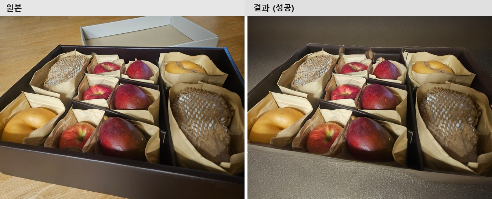
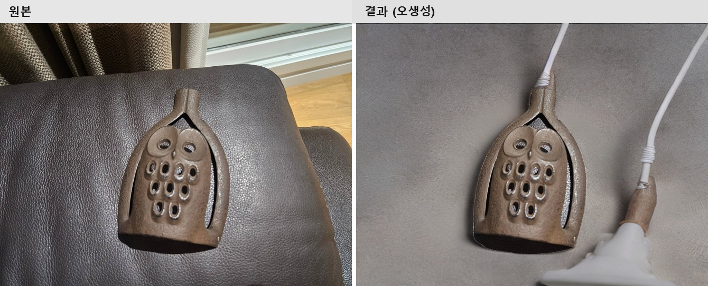
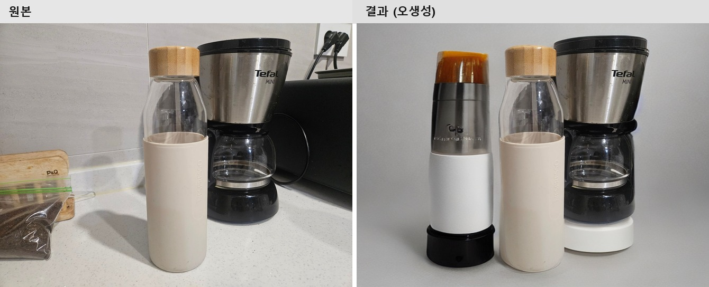
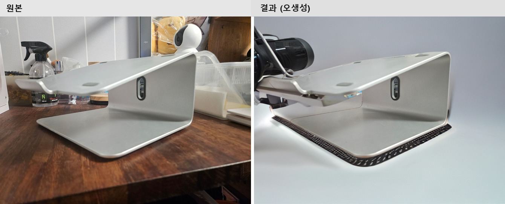
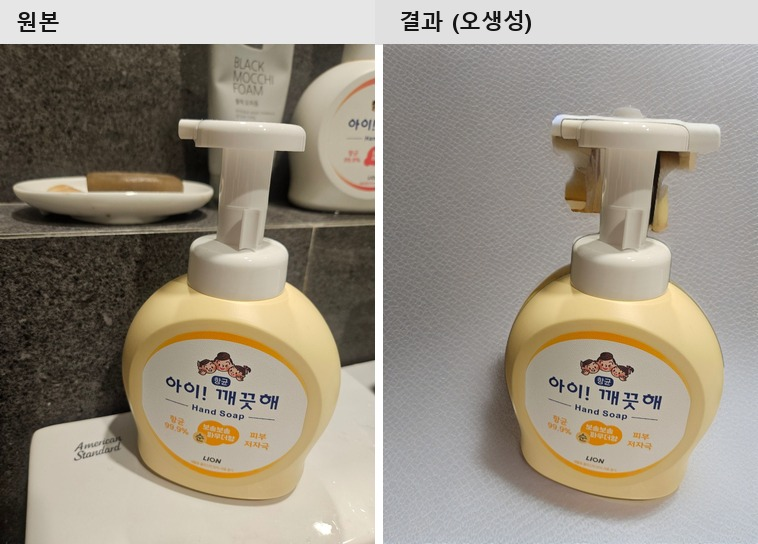
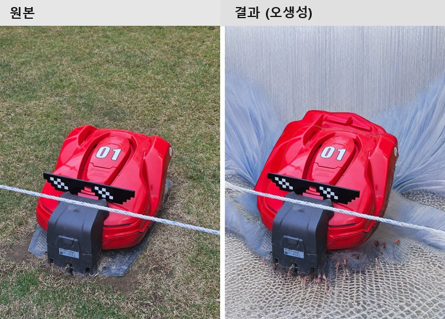

# 결과 평가 — 자가 촬영 상품 사진 배경/조명 정제 PoC

`docs/PROBLEM_DEFINITION.md`에 정의한 성공 기준 3가지를 기준으로, `data/raw/`의 촬영 이미지 20장과
`data/output/refined/`의 결과 20장을 전부 육안으로 비교 평가했다.

이 문서는 두 번째 반복(rembg + diffusion inpainting) 기준이다. 최초 PoC는 상품 분할에 YOLOv8-seg를
썼으나 COCO 80종 밖 상품(용돈박스, 스피커 등) 탐지 실패로 인한 실패율이 꽤 높게 나왔다. 이후 커밋 직전
다른 수강생들의 과제 README를 보다가 Ultralytics YOLOv8이 AGPL-3.0 라이선스라는 걸 뒤늦게 의식하게
됐고, 이미 알고 있던 실패율 문제와 겹쳐 "상업적으로 쓸 수 있는 라이선스 중엔 더 나은 대안이 없을까"
싶어 rembg(U2-Net, MIT)로 교체해 같은 20장을 재평가했다(자세한 경위는
[`MODEL_SELECTION.md`](MODEL_SELECTION.md) 참고).

## 평가 방법

각 결과 이미지를 원본과 나란히 놓고 아래 기준으로 3분류했다.

- **성공**: 배경이 단순/깔끔하게 바뀌었고 원래의 잡동사니가 남아있지 않으며, 별도 수정 없이 상세페이지에 바로 쓸 수 있는 수준
- **무변화**: 배경이 사실상 원본과 동일 — 원본 배경이 이미 단순하거나, diffusion이 구도를 거의 바꾸지 않은 경우
- **오생성**: 배경은 바뀌었지만 원치 않는 소품·장식·중복된 사물 등이 생성되어 오히려 원본보다 쓰기 어려운 경우

**이 문서는 두 번 평가했다.** 1차 평가(축소된 썸네일을 원본과 나란히 놓고 훑어보는 수준)에서는
성공 9/20(45%)이 나왔다. 그런데 06번(swabbox_bathroom)에서 "사라진 줄 알았던 탁상시계가 실제로는
복제돼 있었다"는 걸 확대하고서야 발견한 뒤, **"성공"·"무변화"로 분류했던 나머지 이미지도 전부 확대해서
다시 봤다.** 그 결과 20장 중 12번(toothpick_bathroom, 워터마크)을 포함해 이미 오생성으로 재분류했던
것 외에도 7건이 추가로 오생성으로 드러났다. 아래 결과표·집계는 이 **2차(확대 재검토) 결과**를 최종
기준으로 삼는다.

## 결과표

| # | 파일 | 분류 | 비고 |
|---|---|---|---|
| 01 | speaker_bookshelf | 무변화 | 배경(책·벽 질감)이 원본과 거의 동일하게 유지됨 |
| 02 | sheep_shelf | 오생성 | 어수선한 선반은 직물 질감 배경으로 정리됐으나, 원본에 없던 흰색/검정 원반형 물체가 의자 뒤에 새로 생성됨(확대 전엔 안 보임) |
| 03 | pouch_bed | 오생성 | 침대 시트+인형 배경이 리본·꽃 장식으로 통째로 대체됨 |
| 04 | mug_dark | 오생성 | 배경에 원본에 없던 금속 고리/케이블 형태가 생성됨 |
| 05 | moonlamp_dark | 오생성 | (SD 안전필터 오탐으로 1차 결과가 검은 이미지로 나와 재생성함 — `src/inpaint.py` 참고) 꽃잎·달걀 모양 장식이 대량 생성됨 |
| 06 | swabbox_bathroom | 오생성 | 타일 벽은 깔끔한 텍스처로 정리됐으나, 마스크 경계에 걸쳐 있던 탁상시계가 원본에 없던 2~3개로 중복 생성됨 |
| 07 | bottle_kitchen | 오생성 | 배경은 밝게 정리됐으나, 원본에 없던 두 번째 병(다른 색 뚜껑, 가짜 브랜드 각인까지)이 통째로 생성됨(확대 전엔 안 보임) |
| 08 | backscratcher_desk | 오생성 | 효자손이 원본에 없던 두 번째 개체로 복제 생성됨 |
| 09 | owl_couch | 오생성 | 배경은 깔끔한 회색으로 정리됐으나, 원본에 없던 케이블 두 가닥이 생성되고 부엉이 장식이 하나 더 겹쳐 보임(확대 전엔 안 보임) |
| 10 | fruitbox_floor | **성공** | 나무 바닥이 어두운 단색 배경으로 정리됨. 과일 개수·모양이 원본과 정확히 일치하고 새로 생성된 사물도 없음 — 확대 재검토를 통과한 유일한 사례 |
| 11 | handsoap_bathroom | 오생성 | 주변 다른 제품들은 사라졌으나, 손잡이 틈새로 보이는 배경 일부가 깔끔한 텍스처가 아니라 뭉개진 얼룩으로 남음(확대 전엔 안 보임) |
| 12 | toothpick_bathroom | 오생성 | 화강암 타일은 회색 메시 질감으로 깔끔하게 정리됐으나, 배경 구석에 스톡 사진 워터마크 형태(로고 텍스트 + ID 번호 패턴)가 생성됨 — 육안으로는 흐릿한 무늬처럼 보였지만 확대하면 뚜렷함 |
| 13 | mirrors_giftbox | 오생성 | 하단의 안내 브로슈어 자리에 거울 파편 형태가 추가로 중복 생성됨 |
| 14 | camera_desk | 오생성 | 책상 잡동사니는 사라졌으나, 원본의 검정 트리거 분무기가 완전히 다른 모양의 대형 카메라 렌즈로 왜곡 생성되고 받침대 하단에 없던 질감이 추가됨(확대 전엔 안 보임) |
| 15 | windchime_door | 무변화 | 구도·배경이 원본과 거의 동일하게 유지됨 |
| 16 | cardholder_giftbox | 무변화 | 원본 배경(흰 시트)이 이미 단순해 결과도 거의 동일 |
| 17 | soapset_store | 오생성 | 손·타 브랜드 상자는 사라졌으나, 그 자리에 원본에 없던 빈 흰색 카드/뚜껑 모양이 새로 생성됨(확대 전엔 안 보임) |
| 18 | christmastree_window | 오생성 | 리본·솜뭉치·달걀 장식 등이 대량으로 새로 생성됨 |
| 19 | driedplant_windowsill | 오생성 | 배경에 원본에 없던 금속 조명/암(arm) 구조물이 생성됨 |
| 20 | mower_grass | 오생성 | 잔디는 회색 텍스처로 바뀌었으나 "깔끔"하지 않다 — 마운트 양옆으로 파란빛 털/실 뭉치 같은 헐루시네이션이 부풀어 나옴(확대 전엔 안 보임) |

**집계**: 성공 **1/20 (5%)**, 무변화 3/20 (15%), 오생성 16/20 (80%)

이전 반복(YOLOv8-seg 기반, 성공 7/20·35%) 대비, 뒤바뀐 숫자만 보면 오히려 크게 나빠진 것처럼 보인다.
하지만 실제로는 YOLOv8-seg 기준 35%도 같은 방식(축소 이미지로 훑어보기)으로 평가한 수치라, 그때
"성공"으로 분류된 것들 역시 확대해서 다시 보면 지금과 비슷한 비율로 무너질 가능성이 높다 — 즉 이번에
드러난 건 rembg 교체로 인한 퇴보가 아니라, **애초에 평가 방법 자체가 결함을 잡아내지 못했다**는
사실이다. rembg가 마스크 실패를 없앤 건 여전히 유효하지만, diffusion 쪽 문제는 1차 평가가 생각했던
것보다 훨씬 심각했다.

## 정성 비교 — 원본 vs 결과

### 성공 사례 (1건)

확대 재검토를 통과한 유일한 사례. 상자 안 과일 9개(사과·배·애플망고 등)의 개수·모양·배치가
원본과 정확히 일치하고, 배경만 나무 바닥에서 어두운 단색 배경으로 자연스럽게 바뀌었다. 새로 생성된
사물도, 사라지거나 복제된 사물도 없다.

### 무변화 사례

스피커 자체는 잘 분할됐지만, 배경(책·벽)이 원본과 거의 동일하게 유지됐다 — diffusion이 이미 무난해
보이는 배경은 거의 손대지 않는 경향을 보였다. 나쁜 결과는 아니지만 "정제"라고 보기도 애매한 경계
사례다.

### 오생성 사례

오생성은 확대해서 다시 본 뒤 네 갈래로 나뉜다는 게 드러났다. 유형별로 대표 사례를 든다.

**① 소품·장식 창작형 — 빈 배경에 원본에 없던 사물을 아예 새로 만들어냄**

크리스마스 트리 장식 뒤로 리본·솜뭉치·색색의 달걀 모양 장식품이 대량으로 새로 생성됐다. 원본에 있던
창밖 풍경보다 오히려 더 산만해진, 가장 알아보기 쉬운 오생성 사례다.

반면 이 사례는 처음엔 성공으로 분류했었다 — 어수선한 선반이 직물 질감으로 정리된 것까지만 보고
넘어갔기 때문이다. 확대해보니 의자 뒤쪽에 원본에 전혀 없던 흰색/검정 원반형 물체가 새로 생성돼 있었다.

매대 위 손과 타 브랜드 상품이 치워진 것까지는 의도한 대로였지만, 그 자리에 원본에 없던 커다란 빈
흰색 카드(또는 뚜껑) 모양이 새로 생성됐다. "치운다"가 아니라 "다른 것으로 채운다"에 가깝다는 걸
보여주는 사례.

소파 배경은 깔끔한 회색으로 정리됐지만, 원본에 전혀 없던 전선 두 가닥이 생성됐다. 장식품·소품뿐
아니라 케이블처럼 사소해 보이는 것도 창작 대상이 된다는 걸 보여주는 사례.

**② 경계 사물 복제/왜곡형 — 마스크 경계에 걸친 기존 사물이 늘어나거나 다른 모습으로 바뀜**

이 유형이 가장 위험하다. 사물이 사라진 깔끔한 배경처럼 보여서 성공으로 오분류하기 특히 쉽다.

효자손 하나만 있던 원본인데, 결과물에는 거의 동일한 효자손이 하나 더 생겨났다.

처음엔 "탁상시계가 사라진 성공 사례"로 분류했었다. 실제로는 시계가 2~3개로 겹쳐 복제돼 있었다.

병 하나만 있던 원본인데, 결과물에는 완전히 다른 색(주황 브러시형 뚜껑)에 가짜 브랜드 각인까지 박힌
두 번째 병이 통째로 생성됐다. 단순 복제가 아니라 그럴듯하게 "변형된" 두 번째 제품을 만들어낸다는 점에서
더 알아채기 어렵다.

원본 왼쪽 구석에 걸쳐 있던 검정 트리거 분무기가, 완전히 다른 형태의 대형 카메라 렌즈로 왜곡 생성됐다.

**③ 배경 잔여물 미제거형 — 마스크 구멍 사이로 원본 조각이 깔끔하게 안 지워짐**

펌프 손잡이의 뚫린 틈 사이로 보이는 배경이, 다른 부분과 같은 깔끔한 텍스처가 아니라 뭉개진 얼룩으로
남아있다. 원래 그 틈으로 보이던 다른 제품(Black Mocchi Foam)이 완전히 지워지지 않고 흔적만 남은
것으로 보인다.

**④ 텍스처 헐루시네이션형 — "깔끔한 배경"이 아니라 이상한 재질이 생성됨**

잔디는 사라졌지만, 그 대신 회색 텍스처가 아니라 마운트 양옆으로 부풀어 나온 파란빛 털/실 뭉치 같은
헐루시네이션이 생성됐다. "배경 정리"라는 목표와는 결이 다른, 아예 새로운 재질의 창작에 가깝다.

**공통 발견**: 오생성 16건은 크게 네 유형(①소품 창작 9건, ②경계 사물 복제/왜곡 4건, ③배경 잔여물
미제거 1건, ④텍스처 헐루시네이션 1건) + 스톡 워터마크 재현형 1건(아래 3자 비교 참고)으로 나뉜다.
①은 육안으로도 비교적 알아보기 쉽지만, ②·③·④는 "사물이 없어진 깔끔한 배경"처럼 보여서 확대하지
않으면 성공으로 오분류하기 쉽다 — 실제로 이번 재검토 전까지 02, 07, 09, 11, 14, 17, 20번 7건이
전부 성공으로 분류돼 있었다.

### 수작업 vs AI 3자 비교 (12_toothpick_bathroom)

정량 비교를 위해 같은 사진 한 장을 클립스튜디오로 직접 배경 제거(누끼) 작업까지 해봤다.

수작업 결과는 배경을 완전히 흰색으로 비웠지만, 오랜만에 툴을 켠 탓에 **테두리(누끼 선)가 꽤
들쭉날쭉하다** — 확대해보면 상품 윤곽을 따라 거친 톱니 모양이 남아있다. AI 결과는 테두리는 매끄러운
편이지만, 배경을 확대해보면 오른쪽 하단 구석에 **스톡 사진 워터마크 형태의 텍스트(로고 + ID 번호
패턴**)가 생성돼 있다 — 처음 육안으로 볼 땐 흐릿한 무늬 정도로 지나쳤는데, 확대하고 나서야 발견했다.
그래서 이 이미지는 "무변화/오생성이 아닌 성공"이 아니라, **테두리 품질은 개선됐지만 워터마크 재현이라는
결함이 새로 확인된 오생성 사례**로 재분류했다.

## 성공 기준 대비 평가

### ① 배경/그림자 잔여물 없는 비율 80% 이상
**크게 미달.** 5%(1/20)로, 1차 PoC(35%, 1차 평가 기준)보다도 낮다. 다만 이 수치 하락은 diffusion
모델이 실제로 나빠져서가 아니라, 확대 재검토라는 더 엄격한 검증을 거쳤기 때문이다(위 "평가 방법"
참고). 목표 80%와는 여전히 크게 격차가 있다.

### ② 수작업 대비 처리 시간 단축 폭
자동 처리 속도는 diffusion 추론 단계(25 step) 자체가 바뀌지 않아 이전 측정치와 같은 수준(RTX 3060
기준 장당 약 33초)이다. rembg 마스크 추출은 GPU 없이도 이미지당 1초 내외로 매우 빨라, 전체 파이프라인
속도에는 거의 영향을 주지 않았다.

수작업 기준 시간은 실제로 사진 한 장(12_toothpick_bathroom)을 클립스튜디오로 배경 제거해보고
측정했다: **수작업 10분 → PoC 자동 처리 33초, 약 18배 단축.**

무변화/오생성 케이스(19/20)는 여전히 수작업을 대체하지 못해 검수 시간이 추가로 필요하다 — 그 시간까지
포함하면 실질적인 단축 폭은 위 숫자보다 훨씬 작다. 사실상 "자동 처리 후 결과를 확대해서 검수하는 시간"
자체가 새로운 병목이라는 게 이번 재검토로 드러났다.

### ③ 합성 결과가 자연스러워 바로 쓸 수 있는 비율
①과 동일하게 5% 수준. 나머지는 원본을 그대로 쓰거나(무변화) 재작업이 필요하다(오생성).

## 원인 분석

1. **마스크 추출은 더 이상 실패 원인이 아니다**: rembg는 20장 전부에서 GrabCut 폴백 없이 안정적으로
   동작했다. YOLOv8-seg 시절 발생했던 "COCO 80종 밖 상품 탐지 실패"라는 근본 원인이 사라졌다. 다만
   이것이 곧 "결과가 좋다"를 의미하지는 않았다 — 남은 문제는 전부 diffusion 쪽에 있었다.
2. **"무변화" 패턴 (3건)**: 원본 배경이 이미 단순하거나(16번은 원본 자체가 흰 시트), diffusion이
   상대적으로 무난해 보이는 배경은 적극적으로 바꾸지 않는 경향을 보였다.
3. **"오생성" 패턴 (16건)**: 압도적인 실패 원인이고, 네 가지 하위 유형 + 워터마크 재현형으로 나뉜다.
   - **소품·장식 창작형 (9건: 02, 03, 04, 05, 09, 13, 17, 18, 19번)**: `runwayml/stable-diffusion-inpainting`
     (SD 1.5 기반)이 "clean seamless white studio background" 프롬프트를 과도하게 해석해 조명 장비,
     장식품, 케이블, 빈 카드 등 원본에 없던 사물을 새로 만들어내는 경우.
   - **경계 사물 복제/왜곡형 (4건: 06, 07, 08, 14번)**: 마스크 경계에 걸쳐 있던 기존 사물(탁상시계,
     병, 효자손, 분무기)이 diffusion에 의해 복제되거나 다른 모습으로 왜곡되는 경우. **가장 위험한
     유형** — 육안으로는 "사물이 사라진 깔끔한 배경"처럼 보여서, 확대해서 개수·형태를 대조해보기
     전까진 성공으로 오분류하기 쉽다. 실제로 이번 재검토 전까지 이 유형에 속한 4건 모두 성공으로
     분류돼 있었다.
   - **배경 잔여물 미제거형 (1건: 11번)**: 사물 형태의 뚫린 틈 사이로 보이는 원본 배경 조각이
     깔끔하게 지워지지 않고 뭉개진 얼룩으로 남는 경우.
   - **텍스처 헐루시네이션형 (1건: 20번)**: "깔끔한 배경"이 아니라 원본에 전혀 없던 재질(털/실 뭉치
     형태)이 생성되는 경우.
   - **스톡 워터마크 재현형 (1건: 12번)**: 학습 데이터에 섞인 워터마크 있는 스톡 이미지를 diffusion이
     기억해서 재현하는 memorization 현상.

   다섯 유형 다 마스크를 rembg로 바꾼 뒤에도 그대로 남아있어, 이 문제는 분할 모델이 아니라 diffusion
   모델/프롬프트 자체의 한계라는 결론은 동일하다.
4. **성공 사례는 사실상 1건뿐이다**: 20장 중 확대 재검토를 통과한 건 10번(fruitbox_floor) 하나뿐이다.
   상품 윤곽이 뚜렷하고 배경이 밝은 중간 톤이라는 공통점은 있지만, 표본이 1건이라 일반화하기는 어렵다.
   오히려 더 중요한 발견은 **1차(축소 이미지 훑어보기) 평가에서 성공으로 분류됐던 9건 중 8건이 확대
   재검토에서 탈락했다**는 것 — 즉 육안 훑어보기만으로는 이 파이프라인의 실제 품질을 전혀 가늠할 수
   없었다.

## 다음 단계 제안

- ~~모델 선정 근거는 아직 확정이 아니며, 배경 제거 전용 모델(rembg 등)과 비교 실험 필요~~ → 완료.
  rembg로 교체해 재평가함(이 문서 기준)
- ~~"오생성" 방지를 위해 네거티브 프롬프트 튜닝~~ → 이번 재검토로 오생성 비율이 40%가 아니라 80%임이
  드러난 만큼, 프롬프트 튜닝만으로 해결될 규모가 아닐 가능성이 높다. LaMa처럼 비생성형 inpainting으로
  아예 접근을 바꾸는 실험이 우선순위가 더 높다.
- **모든 결과 이미지를 확대해서 검수하는 단계를 파이프라인에 필수로 넣어야 한다** — 이번 재검토가
  보여준 가장 중요한 교훈. 특히 "②경계 사물 복제/왜곡형"은 축소 이미지로는 절대 못 잡는다.
- SDXL 기반 inpainting이나 LaMa(비-생성형 인페인팅)와 비교해 오생성 빈도 차이 확인 — 지금 수준(80%)이면
  diffusion inpainting 자체가 이 문제에 적합한 접근인지부터 재검토할 필요가 있다.
- 12번에서 발견된 워터마크 재현은 별도 원인(memorization)이라, `watermark, text, logo, signature,
  stock photo` 같은 워터마크 특화 네거티브 프롬프트로 따로 검증 필요
- 어두운/진한 색 배경일수록 오생성이 잦다는 패턴이 1차 평가에서 나왔었는데, 이번 재검토로 밝은 배경
  사례(07, 09, 11, 14, 17번)에서도 다수 오생성이 확인돼 이 패턴 자체를 다시 검증할 필요가 있다.
